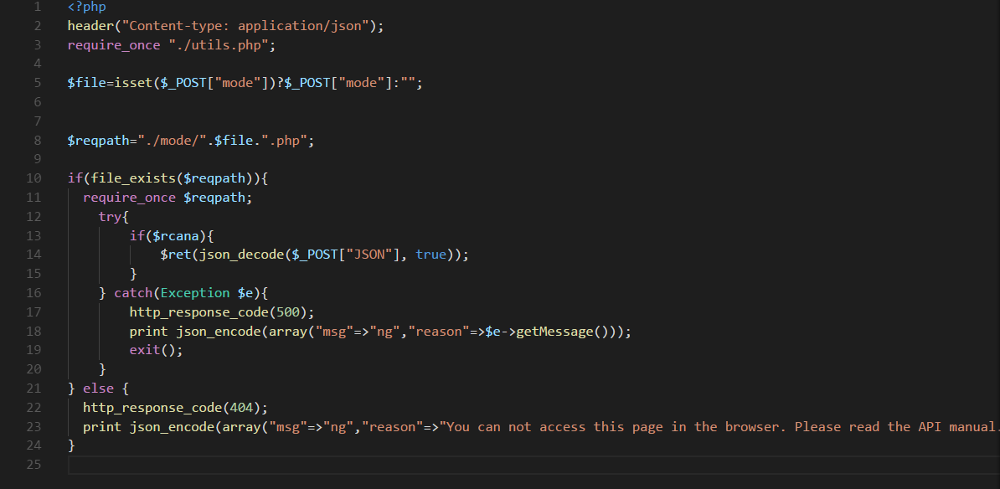

# MBSD Cybersecurity Challenges
調査結果報告書

[東京電子専門学校](http://www.tokyo-ec.ac.jp/)

## チーム：陸のくまさん

## メンバー・役割

熊丸	脆弱性診断・報告書作成

今村	脆弱性診断・報告書作成

森本	脆弱性診断・報告書作成・CVSS評価

## 目次

[TOC]

# 調査手法に関する説明

* 使用したツール・環境

    * OS

        * Windows 10

        * Ubuntu 16.04

        * Ubuntu 17.10

        * Kali Linux 2017.2

        * Arch Linux 2017.10.01-x86_64.iso

    * 仮想環境

        * VMware Workstation Pro 14

        * VirtualBox 5.2.0

    * ネットワークキャプチャーツール

        * Progress Telerik Fiddler Web Debugger

            (https://www.telerik.com/fiddler)

        * wireshark

            (https://www.wireshark.org/download.html)

    * Linuxコマンド(使用した場面)

        * wget(コンテンツをファイルに保存するとき)

        * curl(HTTPリクエストを送信するとき)

        * nmap(ポートスキャンをするとき)

        * sslscan(SSL/TLSの状態を確認したいとき)

        * skipfish(脆弱性を辞書を元に自動調査した)

	        ([https://code.google.com/archive/p/skipfish/](https://code.google.com/archive/p/skipfish/))

    * ブラウザの機能・プラグイン

        * Google Chrome Developer Tools

* 参考資料

    * PDFファイル

        * [安全なウェブサイトの作り方](https://www.ipa.go.jp/files/000017316.pdf)
            * 著作・制作 独立行政法人情報処理推進機構（IPA）

        * [Webアプリケーション脆弱性診断ガイドライン](https://github.com/ueno1000/WebAppPentestGuidelines/blob/master/WebAppPentestGuidelines.pdf)
            * 著作・制作 脆弱性診断士スキルマッププロジェクト (代表 上野宣)

    * 書籍

        * Webセキュリティ担当者のための脆弱性診断スタートガイド 上野宣が教える情報漏えいを防ぐ技術
            * 著作・制作 上野宣

        * 体系的に学ぶ 安全なWebアプリケーションの作り方
            * 著作・制作 徳丸 浩

* 調査手法

    * Fiddler Web Debugger を使用してパケットの内容を閲覧した。その中で、悪意のある第三者に知られると攻撃の手がかりとなりうる情報(例:ユーザーID、パスワード、session-IDなど)が存在していた場合、それらを出力しているHTML・PHPのソースコードにある関数やその引数、変数がないか調べた。

    * Nmapを利用してポートスキャンを実施、開放されているポートを出力し、ポートの設定が適切であるかを調査した。

    * sslscanを利用したSSLの暗号化アルゴリズムのチェックした。

    * PHPソースコードを読み、処理に問題がないかを精査した。

    * パケットアナライザーのWiresharkを利用し、APIを使用した際のパケットの内容を調べ、通信内容や盗聴による情報の流出の可能性について調査した。

    * 脆弱性の影響評価において、基準を明確にするためにCVSS v3を用いて評価した。

    * 調査書の全体構成は、発見した脆弱性を種類ごとにカテゴリ化し、CVSS v3で評価した各脆弱性の環境値の高い順に並べた(仮想OS環境に対する脆弱性グループ以外)。

    * 仮想OS環境に対する脆弱性グループは、今回の銀行システムにおける脆弱性の中では影響としては限定的であるが、VMのroot実行権限取得を通して発見した脆弱性の中には銀行システムの運用上影響があると考えられるものも発見されたため、発見した過程がわかりやすいような順序で構成した。

* CVSSについて

    * IPA 共通脆弱性評価システムCVSS v3概説([https://www.ipa.go.jp/security/vuln/CVSSv3.html](https://www.ipa.go.jp/security/vuln/CVSSv3.html))を参考に、評価した。

    * 基本評価基準のみ算出し、深刻度レベル分けを行った。

    * 評価基準項目

        * 攻撃の難易度評価

            * 攻撃元区分(AV : Attack Vector)

            * 攻撃条件の複雑さ(AC : Attack Complexity)

            * 必要な特権レベル(PR : Privileges Required)

            * ユーザー関与レベル(UI : User Interaction)

        * 攻撃による影響の評価

            * 機密性への評価(C : Confidentiality)

            * 完全性への評価(I : Integrity)

            * 完全性への評価(A : Availability)

        * 脆弱性による影響への広がりの評価(S : Scope)

    * 影響度の算出式

        * 調整前影響度 = 1 - (1 - C)×(1 - I)×(1 - A)

        * 影響度(スコープ変更なし)= 6.42×調整前影響度

        * 影響度(スコープ変更あり)= 7.52×(調整前影響度 - 0.029) - 3.25×(調整前影響度 - 0.02)15

    * 攻撃容易性の算出式

        * 攻撃容易性 = 8.22×AV×AC×PR×UI

    * 基本値の算出式

        * 影響度がゼロ以下の場合

            * 基本値 = 0

        * 影響度がゼロよりも大きい場合

            * スコープ変更なし

                基本値 = RoundUp(min(影響度＋攻撃容易性), 10) (小数点第1位切り上げ)

            * スコープ変更あり

                基本値 = RoundUp(min(1.08×(影響度＋攻撃容易性), 10) (小数点第1位切り上げ)

* 工夫した点

    * 慣れないPHPソースコードを読み、処理に問題がないかを精査した。

    * ツールだけに頼らず、過去に参加したセキュリティコンテストの経験を元に調査した。

    * ツールを使用するとき、WEBで「ツール名＋脆弱性」で調べると、そのツールを使用して脆弱性を調査していた人のWriteupが見つかることがあるので、積極的に利用した。

    * CVSS v3の影響評価の際に、評価基準をもとにExcelで影響度を自動的に算出するシートを作成した。

	

# 発見した脆弱性詳細

## SQLインジェクションによる脆弱性グループ

1. SQLインジェクション

\[対象]

* APIのうち、mode=activateを利用する操作全て

\[CVSS]

* 基本評価基準

<table>
  <tr>
    <td>攻撃元区分</td>
    <td>ネットワーク(N)</td>
  </tr>
  <tr>
    <td>攻撃条件の複雑さ</td>
    <td>高(H)</td>
  </tr>
  <tr>
    <td>必要な特権レベル</td>
    <td>低(L)</td>
  </tr>
  <tr>
    <td>ユーザー関与レベル</td>
    <td>要(R)</td>
  </tr>
  <tr>
    <td>影響の想定範囲</td>
    <td>変更あり(C)</td>
  </tr>
  <tr>
    <td>機密性への影響</td>
    <td>高(H)</td>
  </tr>
  <tr>
    <td>完全性への影響</td>
    <td>高(H)</td>
  </tr>
  <tr>
    <td>可用性への影響</td>
    <td>低(L)</td>
  </tr>
  <tr>
    <td>環境値</td>
    <td>7.9 - 重要</td>
  </tr>
</table>

\[解説]

* activate.php より、ソースコード中の $user = util_call("sql","SELECT * FROM users WHERE bankcode='{$params\['bankcode']}' AND activate = 0"); について bankcode='口座番号'となっている。

そこを「$params\['' OR bankcode!='']」という風に書き換えると「空白 or 空白でない and アクティベートされていない」という意味のSQL文になる。

そうすると、最終的には「アクティベートされていないアカウントを無条件にアクティベートする」という処理が行えるようになる。

* なお、初期パスワードと OTP は正規のもので脆弱性を確認した。

\[想定される被害・影響]

* 初期 PW と OTP がわかる場合、口座番号が不明でも アクティベート可能。

* 27ページの"入力項目が不足していても口座が開設できてしまう”の項で説明するものと合わせると口座を勝手に開設して勝手にアクティベートすることが可能である。 

\[対策]

* エスケープ処理を施す。(シングルクォーテーションを無害な文字に変換する)

## ディレクトリトラバーサルによる脆弱性グループ

1. ディレクトリトラバーサルによるphpinfoの表示

\[対象]

* APIにおいて、modeにパラメータを指定するものすべて

\[CVSS]

* 基本評価基準

<table>
  <tr>
    <td>攻撃元区分</td>
    <td>ネットワーク(N)</td>
  </tr>
  <tr>
    <td>攻撃条件の複雑さ</td>
    <td>低(L)</td>
  </tr>
  <tr>
    <td>必要な特権レベル</td>
    <td>不要(N)</td>
  </tr>
  <tr>
    <td>ユーザー関与レベル</td>
    <td>不要(N)</td>
  </tr>
  <tr>
    <td>影響の想定範囲</td>
    <td>変更あり(C)</td>
  </tr>
  <tr>
    <td>機密性への影響</td>
    <td>高(H)</td>
  </tr>
  <tr>
    <td>完全性への影響</td>
    <td>高(H)</td>
  </tr>
  <tr>
    <td>可用性への影響</td>
    <td>高(H)</td>
  </tr>
  <tr>
    <td>環境値</td>
    <td>10 - 緊急</td>
  </tr>
</table>

\[解説]

* phpinfo関数は、PHP実行環境の設定の一覧をHTML出力で表示するものである。これを外部から実行されると、PHPの設定情報が流出して攻撃されるリスクが非常に高くなる。

* 今回は、アプリケーション・プログラムのディレクトリ内にphpinfo関数のみが記述されたphpinfo.phpというファイルがあり、これをディレクトリトラバーサルによって実行して設定情報を出力した。

* 以下のコマンドによって出力できた。

<table>
  <tr>
    <td>$ curl MBSDサーバーIPアドレス -d "mode=../phpinfo&JSON={}"</td>
  </tr>
  <tr>
    <td>$ wget MBSDサーバーIPアドレス --post-data="mode=../phpinfo&JSON={}"</td>
  </tr>
</table>

\[想定される被害・影響]

* phpinfoの出力。攻撃の材料となるような設定情報が多く含まれており、外部から参照できることは極めて危険である。 

\[対策]

* アプリケーションのディレクトリからphpinfo.phpを削除する

* php.iniでphpinfoの実行を禁止にする。 

* ディレクトリトラバーサルの対策を行う。

1. APIのmodeパラメータを利用したディレクトリトラバーサル

\[対象]

* APIにおいて、modeにパラメータを指定するものすべて

\[CVSS]

* 基本評価基準

<table>
  <tr>
    <td>攻撃元区分</td>
    <td>ネットワーク(N)</td>
  </tr>
  <tr>
    <td>攻撃条件の複雑さ</td>
    <td>低(L)</td>
  </tr>
  <tr>
    <td>必要な特権レベル</td>
    <td>不要(N)</td>
  </tr>
  <tr>
    <td>ユーザー関与レベル</td>
    <td>不要(N)</td>
  </tr>
  <tr>
    <td>影響の想定範囲</td>
    <td>変更あり(C)</td>
  </tr>
  <tr>
    <td>機密性への影響</td>
    <td>低(L)</td>
  </tr>
  <tr>
    <td>完全性への影響</td>
    <td>低(L)</td>
  </tr>
  <tr>
    <td>可用性への影響</td>
    <td>なし(N)</td>
  </tr>
  <tr>
    <td>環境値</td>
    <td>7.2 - 重要</td>
  </tr>
</table>

\[解説]

* APIは全ての操作においてmodeパラメータで操作を指定する必要がある。このとき、内部ではアプリケーションを構成するMBSD_Bankディレクトリの中にあるmodeディレクトリに、機能ごとにphp作成されたプログラムを呼び出すという処理が行われている。APIが呼び出されるたびにmodeパラメータの値をファイルパスとして挿入し、各PHPプログラムを呼び出す。例えば、mode="user”というパラメータならば、実際の処理はMBSD_Bank/mode/user.phpを呼び出すというものになる。
しかしながら、modeパラメータに関して、特別な文字列を置き換えるエスケープ処理がなされておらず、そのままユーザーが入力された値が使われており、また各ファイルのパス指定が相対パスで行われているために、ディレクトリトラバーサルや、ローカル ファイルインクルージョン、nullバイト攻撃が可能な状態となっている。例えば、"mode=../xxx.php”といった相対パスが挿入された場合、実際の処理はMBSD/mode/../xxx.phpを呼び出すといった操作になる。

* この脆弱性による具体的な問題については別項として挙げる。

* index.phpのソースコード該当部

ソースコードにおいてAPIでユーザーが入力した値をそのままファイルパスとして使用している。ユーザーが"../../../"といった相対パスをmode属性として入力した場合、容易にディレクトリトラバーサルが発生してしまう。 

\[想定される被害・影響]

* modeパラメータに"../../../xxx"のような相対ファイルパスや'\00'のような文字が挿入された場合にディレクトリトラバーサルやローカルファイルインクルージョン、nullバイト攻撃が可能であり、意図しないプログラムの実行や内部情報の流出が想定される。 

\[対策]

* ソースコードの

<table>
  <tr>
    <td>$reqpath=  "/mode/".$file.".php"; </td>
  </tr>
</table>

を

<table>
  <tr>
    <td>$reqpath= __FILE__ "/mode/".$file.".php";</td>
  </tr>
</table>

のような絶対パス指定にする。

また、ユーザーが入力した値にはスラッシュ等 の文字を別の文字に置き換えるエスケープ処理を行う。

## 認証による脆弱性グループ

1. 自己証明書(通称オレオレ証明書)による不正な認証

\[対象]

* 対象アドレス https://MBSD銀行のアドレス (SSL通信を使うもの全般)

\[CVSS]

* 基本評価基準

<table>
  <tr>
    <td>攻撃元区分</td>
    <td>ネットワーク(N)</td>
  </tr>
  <tr>
    <td>攻撃条件の複雑さ</td>
    <td>低(L)</td>
  </tr>
  <tr>
    <td>必要な特権レベル</td>
    <td>不要(N)</td>
  </tr>
  <tr>
    <td>ユーザー関与レベル</td>
    <td>不要(N)</td>
  </tr>
  <tr>
    <td>影響の想定範囲</td>
    <td>変更なし(U)</td>
  </tr>
  <tr>
    <td>機密性への影響</td>
    <td>高(H)</td>
  </tr>
  <tr>
    <td>完全性への影響</td>
    <td>高(H)</td>
  </tr>
  <tr>
    <td>可用性への影響</td>
    <td>なし(N)</td>
  </tr>
  <tr>
    <td>環境値</td>
    <td>9.1 - 緊急</td>
  </tr>
</table>

\[解説]

* SSL証明書に、自己証明書が使用されている。 本来、SSL証明書は信頼のあるCA(認証局)が発行する証明書を利用することによりドメインやそのドメインを所有する組織の信頼性を客観的に確認することができる。しかし、今回の場合は開発元自身が発行する自己証明書が利用されている。

HTTPS通信でアクセスしようとした場合、自己証明書であるため通信の相手が本物か確認できずにセキュリティ警告が出る。Chrome開発者ツールでも"This page is not serucre(broken HTTPS)”といった、HTTPSが安全ではない旨が表示される。

SSL証明書の発行先と発行元がともにMBSDとなっている。本来は、発行元が信頼されたSSL認証局の名称でなければならない。

\[想定される被害・影響]

* ドメインを所有する組織を装った、中間者攻撃による通信内容の盗聴や銀行口座の入出送金操作やユーザー情報の取得。

\[対策]

* 信頼のある認証局によるSSL証明書を利用する。 ドメイン証明書はドメイン保有が不正でないことしか証明できないため、金融機関のサービスにおいてはドメイン所有者の登記について客観的な審査も行われるEV SSLの利用が好ましい。

\[備考]

* 今回の課題の場合、VMを配布して検証するという形式であり正式な証明書の取得ができないため、自己証明書の利用はやむを得ないが、脆弱性の1つとして挙げた。

2. 応答パケットにログインしたアカウントの登録情報が含まれている

\[対象]

* APIのうち、mode=loginによってログインに成功したときの応答パケット

\[CVSS]

* 基本評価基準

<table>
  <tr>
    <td>攻撃元区分</td>
    <td>隣接(A)</td>
  </tr>
  <tr>
    <td>攻撃条件の複雑さ</td>
    <td>低(L)</td>
  </tr>
  <tr>
    <td>必要な特権レベル</td>
    <td>不要(N)</td>
  </tr>
  <tr>
    <td>ユーザー関与レベル</td>
    <td>要(R)</td>
  </tr>
  <tr>
    <td>影響の想定範囲</td>
    <td>変更あり(C)</td>
  </tr>
  <tr>
    <td>機密性への影響</td>
    <td>高(H)</td>
  </tr>
  <tr>
    <td>完全性への影響</td>
    <td>高(H)</td>
  </tr>
  <tr>
    <td>可用性への影響</td>
    <td>なし(N)</td>
  </tr>
  <tr>
    <td>環境値</td>
    <td>8.5 - 重要</td>
  </tr>
</table>

\[解説]

* 登録済みユーザーの正規のIDとPWでログインしたときの応答パケットにそのユーザーの情報が登録されているDB表の内容が含まれていた。

		また、session.phpの内容も含まれていた。

		登録済みの5つのアカウントで確認した。

		

<table>
  <tr>
    <td>HTTP/1.1 200 OK
Date: Wed, 08 Nov 2017 16:45:52 GMT
Server: Apache
X-Frame-Options: SAMEORIGIN
Content-Length: 345
Keep-Alive: timeout=5, max=97
Connection: Keep-Alive
Content-Type: application/json

{"msg":"ok","session":"d7904537361ce71801751a505d3ef52f2f63b754","user":{"id":"6","bankcode":"3174688","activate":"1","loginid":"mbsd101","branch_code":"001","name_sei":"\u963f\u4e45\u6fa4","name_mei":"\u570b\u96c4","name_sei_kana":"\u30a2\u30af\u30b6\u30ef","name_mei_kana":"\u30af\u30cb\u30aa","balance":"100000","otpbase":"BMLPKLL57Z3HL3SI"}}</td>
  </tr>
</table>

\[想定される被害・影響]

* サーバからの応答パケットを悪意のある第三者に窃取された場合、正規のユーザーになりすましてログインできる可能性がある。

* また、IDとPWを他のサービスで利用していた場合そちらでもログインできてしまう可能性がある。

\[対策]

* サーバからの応答パケットに含める必要性はないので、含めないようにする。

		login.phpの中の

<table>
  <tr>
    <td>$user = util_call("sql","SELECT * FROM users WHERE loginid='{$params\['loginid']}'");</td>
  </tr>
</table>

でログインID列の値が一致すると全列検索して

<table>
  <tr>
    <td>printjson_encode
(array("msg"=>"ok","session"=>$sess\["__id__"],"user"=>$user\[0]));</td>
  </tr>
</table>

において出力されるので、このコードを削除すれば解決する。

3. OTP取得時のシードとOTPが暗号化されずにパケット上に存在

\[対象]

* APIのmode=systemまたはsystem.php

\[CVSS]

* 基本評価基準

<table>
  <tr>
    <td>攻撃元区分</td>
    <td>隣接(A)</td>
  </tr>
  <tr>
    <td>攻撃条件の複雑さ</td>
    <td>低(L)</td>
  </tr>
  <tr>
    <td>必要な特権レベル</td>
    <td>不要(N)</td>
  </tr>
  <tr>
    <td>ユーザー関与レベル</td>
    <td>要(R)</td>
  </tr>
  <tr>
    <td>影響の想定範囲</td>
    <td>変更あり(C)</td>
  </tr>
  <tr>
    <td>機密性への影響</td>
    <td>高(H)</td>
  </tr>
  <tr>
    <td>完全性への影響</td>
    <td>低(L)</td>
  </tr>
  <tr>
    <td>可用性への影響</td>
    <td>なし(N)</td>
  </tr>
  <tr>
    <td>環境値</td>
    <td>7.4 - 重要</td>
  </tr>
</table>

\[解説]

* OTPを取得するときのサーバーとの送受信の内容が第3者にも見えてしまう。

\[想定される被害・影響]

* OTPを必要とする処理に使用されれば第三者が通信に割り込むセッションハイジャックに利用される恐れがある。

\[対策]

* 通信経路を暗号化する。

1. ログインの試行回数が無制限

\[対象]

* APIのうち、mode=loginによってログインする動作

\[CVSS]

* 基本評価基準

<table>
  <tr>
    <td>攻撃元区分</td>
    <td>ネットワーク(N)</td>
  </tr>
  <tr>
    <td>攻撃条件の複雑さ</td>
    <td>低(L)</td>
  </tr>
  <tr>
    <td>必要な特権レベル</td>
    <td>不要(N)</td>
  </tr>
  <tr>
    <td>ユーザー関与レベル</td>
    <td>不要(N)</td>
  </tr>
  <tr>
    <td>影響の想定範囲</td>
    <td>変更なし(U)</td>
  </tr>
  <tr>
    <td>機密性への影響</td>
    <td>低(L)</td>
  </tr>
  <tr>
    <td>完全性への影響</td>
    <td>低(L)</td>
  </tr>
  <tr>
    <td>可用性への影響</td>
    <td>なし(N)</td>
  </tr>
  <tr>
    <td>環境値</td>
    <td>6.5 - 警告</td>
  </tr>
</table>

\[解説]

* ログインの行える回数が制限されていなかった。

\[想定される被害・影響]

* 総当たり攻撃によって ID や PW が漏洩する恐れがある。

* また、それを利用してリスト型攻撃に発展する恐れがある。 

\[対策]

* ログインに失敗した回数に応じて一定時間ログインできないようにする。

* また、普段とは違う IP からのログインの場合、正規の利用者に メール等で通知するようにする。

* 例)3回失敗した場合1時間ログイン不可にする。利用者にはログインした端末の IP に心当たりがあるか確認する。

## HTTP/HTTPSによる脆弱性グループ

1. ApacheのDirectoryIndex設定による内部ファイルの表示

\[対象]

* 銀行システムへのアクセスすべて

\[CVSS]

* 基本評価基準

<table>
  <tr>
    <td>攻撃元区分</td>
    <td>ネットワーク(N)</td>
  </tr>
  <tr>
    <td>攻撃条件の複雑さ</td>
    <td>低(L)</td>
  </tr>
  <tr>
    <td>必要な特権レベル</td>
    <td>不要(N)</td>
  </tr>
  <tr>
    <td>ユーザー関与レベル</td>
    <td>不要(N)</td>
  </tr>
  <tr>
    <td>影響の想定範囲</td>
    <td>変更あり(C)</td>
  </tr>
  <tr>
    <td>機密性への影響</td>
    <td>高(H)</td>
  </tr>
  <tr>
    <td>完全性への影響</td>
    <td>高(H)</td>
  </tr>
  <tr>
    <td>可用性への影響</td>
    <td>なし(N)</td>
  </tr>
  <tr>
    <td>環境値</td>
    <td>10 - 緊急</td>
  </tr>
</table>

\[解説]

* [http://MBSDサーバー](http://MBSDサーバー/)以下にディレクトリ名を入力し、ブラウザからアクセスすると、ディレクトリの内部の一覧が閲覧できてしまう。

/libディレクトリのファイル一覧

	

* 実際にブラウザからファイル一覧が閲覧できたディレクトリは以下の通りである。

    * /lib

    * /util

    * /tmp

    * /mode

また、ディレクトリトラバーサルのグループでも挙げたディレクトリトラバーサルによるphpinfoの表示も/phpinfo.phpを入力することによって取得可能である。

* このうちtmpファイル内にセッションIDの名前のファイルがある。これはログイン中のユーザーのセッション情報を一時的に保存するディレクトリであり、ユーザーのセッションIDを盗み見ることができる。一時的に保存されるセッション情報の例は次のとおりである。

例)05ca43b9d3f3623a720996291b5de435d6efae5bファイル内 の記述は以下の1行のみ

<table>
  <tr>
    <td>a:3{s:6:"__id__"; s:40:"a6f6aa79ef14e26829208dbb02bd9874a0746319"; 41s:8:"__time__";i:1509991751;s:3:"uid";s:1:"6";}</td>
  </tr>
</table>

\[想定される被害・影響]

* セッションハイジャックが可能になる。

* phpinfoの取得により、PHP動作環境の不適切な設定を利用した攻撃の可能性が高まる。

* 外部のアクセスによりシステムの内部構造がわかってしまい、攻撃の材料となってしまう可能性がある。

\[対策]

* Apacheの設定において、銀行システムがあるフォルダ全体において有効になっているOptions Indexes FollowSymLinksを無効にする。

* セッションIDの一時ファイルに対し、暗号化をかける。または、外部からアクセスできないディレクトリに置く。

1. HTTPによる平文での通信

\[対象]

* 対象アドレス http://MBSD銀行のアドレス (HTTPで通信するもの全般)

\[CVSS]

* 基本評価基準

<table>
  <tr>
    <td>攻撃元区分</td>
    <td>ネットワーク(N)</td>
  </tr>
  <tr>
    <td>攻撃条件の複雑さ</td>
    <td>低(L)</td>
  </tr>
  <tr>
    <td>必要な特権レベル</td>
    <td>不要(N)</td>
  </tr>
  <tr>
    <td>ユーザー関与レベル</td>
    <td>不要(N)</td>
  </tr>
  <tr>
    <td>影響の想定範囲</td>
    <td>変更なし(U)</td>
  </tr>
  <tr>
    <td>機密性への影響</td>
    <td>高(H)</td>
  </tr>
  <tr>
    <td>完全性への影響</td>
    <td>高(H)</td>
  </tr>
  <tr>
    <td>可用性への影響</td>
    <td>なし(N)</td>
  </tr>
  <tr>
    <td>環境値</td>
    <td>9.1 - 緊急</td>
  </tr>
</table>

\[解説]

* APIは個人情報を含むものをHTTPのPOSTメソッドを利用して送信する仕様であるが、HTTPSによるサーバーとクライアント間による通信の暗号化が施されていないため、個人情報を含む情報全てが平文で送信されてしまっている。API自体はHTTPSによる暗号化通信も対応しているが、HTTPでも通信ができてしまうため、不注意や環境によって意図しないHTTPでの平文での通信という人為的インシデントを誘発する可能性がある。

* APIのuserを利用した際のクライアントとサーバ間の通信の傍受が可能

\[想定される被害・影響]

* 悪意ある第三者によるユーザーの個人情報や口座の入出送金記録等の通信内容の傍受、それに伴う個人情報流出や口座への不正な操作。

\[対策]

* 現在、ベンダーがサポートするブラウザや端末においてHTTPSで通信できないクライアントはほとんど存在しないため、HTTPSでの通信を強制する。HTTPによるアクセスはWebサーバ側でHTTPSによる通信にリダイレクトすることによってHTTPSでの通信を強	制することができる。

現行のブラウザやスマートフォン、フィーチャーフォンのほとんどでSHA-2によるSSL通信を行うことができる。

(引用：日本ジオトラスト株式会社 対応ブラウザ・スマートフォン・携帯電話より

URL : https://www.geotrust.co.jp/products/resources/compatibility_listing/)

## プログラムの不備に起因する脆弱性グループ

1. 銀行APIのSystemAPIの銀行外LANからの実行の可能性

\[対象]

* APIのうち、本来銀行内のネットワークからのみ実行できるmode=systemを利用した新規アカウントのアクティベーションを始めとした全ての動作。 

\[CVSS]

* 基本評価基準

<table>
  <tr>
    <td>攻撃元区分</td>
    <td>ネットワーク(N)</td>
  </tr>
  <tr>
    <td>攻撃条件の複雑さ</td>
    <td>高(H)</td>
  </tr>
  <tr>
    <td>必要な特権レベル</td>
    <td>低(L)</td>
  </tr>
  <tr>
    <td>ユーザー関与レベル</td>
    <td>不要(N)</td>
  </tr>
  <tr>
    <td>影響の想定範囲</td>
    <td>変更あり(C)</td>
  </tr>
  <tr>
    <td>機密性への影響</td>
    <td>高(H)</td>
  </tr>
  <tr>
    <td>完全性への影響</td>
    <td>高(H)</td>
  </tr>
  <tr>
    <td>可用性への影響</td>
    <td>なし(N)</td>
  </tr>
  <tr>
    <td>環境値</td>
    <td>8.2 - 重要</td>
  </tr>
</table>

\[解説]

* SystemAPIは、銀行が新規登録されたアカウントをアクティベーションしてOTPのシードや初期パスワードの発行やするために、 銀行内のネットワークからのみ実行できる仕様となっている。

しかし、銀行内からのアクセスかどうかを判別する方法が、予め決められた銀行内のローカルIPアドレスからのアクセスかどうかのみである。これは ローカルネットワークからのアクセスを装ってIPアドレスを偽装してアクセスする IPスプーフィングの攻撃に対しては脆弱であると考えられる。

クライアントのIPアドレスを取得するプログラムのソースコードの /util/getrealip.phpではHTTPヘッダに'HTTP_X_FORWARDED_FOR'パラメータがあると、無条件にこの項目の先頭の項目を送信元IPアドレスと判断してしまうため、HTTPヘッダを書き換える事ができれば容易にIP アドレス偽装ができる可能性がある。

getrealip.phpのソースコード

\[想定される被害・影響]

* 銀行外部のアクセスからSystemAPIを利用して、アカウントのアクティベーションや口座の操作が行える可能性がある。

\[対策]

* IPアドレスでの認証とパスワード認証やスマートカード等を組み合わせた多要素認証を導入する。

2. register.phpにおける情報送信前の暗号化の未実装

\[対象]

* APIのmode=registerによる操作

\[CVSS]

* 基本評価基準

<table>
  <tr>
    <td>攻撃元区分</td>
    <td>隣接(A)</td>
  </tr>
  <tr>
    <td>攻撃条件の複雑さ</td>
    <td>高(H)</td>
  </tr>
  <tr>
    <td>必要な特権レベル</td>
    <td>低(L)</td>
  </tr>
  <tr>
    <td>ユーザー関与レベル</td>
    <td>要(R)</td>
  </tr>
  <tr>
    <td>影響の想定範囲</td>
    <td>変更あり(C)</td>
  </tr>
  <tr>
    <td>機密性への影響</td>
    <td>高(H)</td>
  </tr>
  <tr>
    <td>完全性への影響</td>
    <td>高(H)</td>
  </tr>
  <tr>
    <td>可用性への影響</td>
    <td>なし(N)</td>
  </tr>
  <tr>
    <td>環境値</td>
    <td>7.3 - 重要</td>
  </tr>
</table>

\[解説]

* /mode/register.phpはAPIのregisterの実装であるが、POSTで送信されたユーザーの登録情報を引数として取得して内容を判定、問題がなければデータベースにユーザ情報の一部を登録、同時に銀行ネットワーク内の基盤システムに情報を送信する 仕組みとなっている。基盤システムに情報を送信する際には/util/send.phpを利用して送信する。しかし、送信前のデータは暗号化されていない。このため、送信時にユーザーの個人情報が平文のまま送信されてしまう。

register.phpのコード、送信処理のsend.phpが呼び出されるまでの間に暗号化の処理が見当たらない。

ここで、/util/send.phpのソースコードに注目する。

/util/send.phpのソースコード

この/util/send.phpの上部にコメントで引数の内容がメモ書きされているのがわかる。第1引数では各支店のエンドポイントURL、 第2引数では"Encrypted Sending Data”という記述がある。これをもとに推察すると、この/util/send.phpを利用した情報の送信においては、送信内容は暗号化された状態で送信される必要がある。しかし、register.phpでは暗号化の処理が書かれていないということは、プログラム作成者がsend.phpの仕様を把握せずに開発をおこなったか、処理を入れ忘れたといった人為的ミスによるものであると推察される。

		

\[想定される被害・影響]

* 個人情報が暗号化されずに平文のまま送信されることによる、顧客情報の盗聴、それに伴う流出。

\[対策]

* /util/encrypt.phpで暗号化の実装が行われているため、それをデータ送信前に呼び出し、送信データの暗号化を行えばよい。

3. 入力項目が不足していても口座が開設できてしまう

\[対象]

* APIのうちmode=registerを利用した登録処理

\[CVSS]

* 基本評価基準

<table>
  <tr>
    <td>攻撃元区分</td>
    <td>ネットワーク(N)</td>
  </tr>
  <tr>
    <td>攻撃条件の複雑さ</td>
    <td>高(H)</td>
  </tr>
  <tr>
    <td>必要な特権レベル</td>
    <td>低(L)</td>
  </tr>
  <tr>
    <td>ユーザー関与レベル</td>
    <td>要(R)</td>
  </tr>
  <tr>
    <td>影響の想定範囲</td>
    <td>変更なし(U)</td>
  </tr>
  <tr>
    <td>機密性への影響</td>
    <td>低(L)</td>
  </tr>
  <tr>
    <td>完全性への影響</td>
    <td>高(H)</td>
  </tr>
  <tr>
    <td>可用性への影響</td>
    <td>低(L)</td>
  </tr>
  <tr>
    <td>環境値</td>
    <td>5.9 - 警告</td>
  </tr>
</table>

\[解説]

* 郵便番号、住所、年齢が入力されていなくても口座の開設ができてしまう。

register.phpのコードより、

<table>
  <tr>
    <td>if( count(util_call("sql","SELECT * FROM users WHERE loginid=?",$params["loginid"]) ) ==0 )</td>
  </tr>
</table>

入力したログインIDがuser表に存在するか確認している。

<table>
  <tr>
    <td>if( strlen($params["loginid"]) > 5 && strlen($params["loginid"]) < 13 &&
strlen($params["name_sei"]) > 1 &&strlen($params["name_mei"]) > 1 &&
preg_match("/^[ァ-ヾ]+$/u",$params["name_sei_kana"]) && preg_match("/^[ァ-ヾ]+$/u",$params["name_mei_kana"]))</td>
  </tr>
</table>

次に、入力したログインIDが６文字以上且つ13文字未満且つ姓名が1文字以上且つカナがカタカナで入力されているかを確認している。

<table>
  <tr>
    <td>util_call("sql","INSERT INTO users(loginid,branch_code,name_sei,name_mei,name_sei_kana,name_mei_kana)VALUES (?,'000',?,?,?,?)",$params["loginid"],$params["name_sei"],$params["name_mei"],$params["name_sei_kana"],$params["name_mei_kana"]★★★);</td>
  </tr>
</table>

そして、insert句によって新たなアカウントが作成される。

\[想定される被害・影響]

* 個人の特定をすることなく無限にアカウントが作成できてしまう。

* 口座を作れない人に口座を売るなどの行為ができる。

* 個人情報を入力する必要がないので、足がつきにくくなる。

\[対策]

* 郵便番号、住所、年齢も入力させるように引数を増やし、引数それぞれが入力されているかチェックするようにする。

		以下、修正後のコードです。★★★の部分に追加した。

<table>
  <tr>
    <td>&& strlen($params["address"]) > 13 && $params["old"] > 17 && strlen($params["zipcode"]) > 6</td>
  </tr>
</table>

住所は、調べた範囲では千葉県旭市ロ1が日本で一番短い住所なので

([https://detail.chiebukuro.yahoo.co.jp/qa/question_detail/q10121307945](https://detail.chiebukuro.yahoo.co.jp/qa/question_detail/q10121307945))

漢字2ﾊﾞｲﾄで計算すると13ﾊﾞｲﾄ以上の入力を要求する。

年齢は銀行によっても対応が違うので未成年は拒否するようにした。

郵便番号は7桁で入力するので6ﾊﾞｲﾄ以上要求する。

1. 空白のまま実行すると当該表の内容が出力される

\[対象]

* APIのうち、mode=banklistとmode=branchlistを利用して銀行・支店情報を取得する動作

\[CVSS]

* 基本評価基準

<table>
  <tr>
    <td>攻撃元区分</td>
    <td>ネットワーク(N)</td>
  </tr>
  <tr>
    <td>攻撃条件の複雑さ</td>
    <td>低(L)</td>
  </tr>
  <tr>
    <td>必要な特権レベル</td>
    <td>不要(N)</td>
  </tr>
  <tr>
    <td>ユーザー関与レベル</td>
    <td>不要(N)</td>
  </tr>
  <tr>
    <td>影響の想定範囲</td>
    <td>変更なし(U)</td>
  </tr>
  <tr>
    <td>機密性への影響</td>
    <td>低(L)</td>
  </tr>
  <tr>
    <td>完全性への影響</td>
    <td>なし(N)</td>
  </tr>
  <tr>
    <td>可用性への影響</td>
    <td>なし(N)</td>
  </tr>
  <tr>
    <td>環境値</td>
    <td>5.3 - 警告</td>
  </tr>
</table>

\[解説]

* 銀行コード及び支店コードが空白のままPOSTを投げると banks 表と branchs 表の全列名と値が出力される。

<table>
  <tr>
    <td>{"msg":"ok","bank":[{"id":"1","name":"MBSD\u9280\u884c","code":"0001","endpointurl":"https:\/\/bank.mbsd.example\/hidden_server.php","charge":"0"},{"id":"2","name":"\u30a2\u30c3\u30d7\u30eb\u9280\u884c","code":"0002","endpointurl":"https:\/\/bank.apple.example\/test\/ok.php","charge":"216"},{"id":"3","name":"\u30ad\u30a6\u30a4\u9280\u884c","code":"0003","endpointurl":"https:\/\/bank.kiwi.example\/test\/ok.php","charge":"216"},{"id":"4","name":"\u30c9\u30ea\u30a2\u30f3\u9280\u884c","code":"0004","endpointurl":"https:\/\/bank.durian.example\/test\/ok.php","charge":"108"},{"id":"5","name":"\u30d6\u30f3\u30bf\u30f3\u9280\u884c","code":"0005","endpointurl":"https:\/\/bank.pomelo.example\/test\/ok.php","charge":"216"},{"id":"6","name":"\u30e9\u30ba\u30d9\u30ea\u30fc\u9280\u884c","code":"0006","endpointurl":"https:\/\/bank.raspberry.example\/test\/ok.php","charge":"108"}]}</td>
  </tr>
</table>

		以下のコマンドによって実行できた。

<table>
  <tr>
    <td>$ curl MBSDサーバーIPアドレス -d "mode=banklist&JSON={}"</td>
  </tr>
  <tr>
    <td>$ wget MBSDサーバーIPアドレス --post-data="mode=banklist&JSON={}"</td>
  </tr>
</table>

	

\[想定される被害・影響]

* verify(振込処理実行)において銀行と支店をしようされる等攻撃の足掛かりとなる。

\[対策]

* 入力値が空白でないことを確認してから処理するようにする。

* また、表の列名と値が送信されないようにする。

## セッションIDによる脆弱性グループ

1. セッションIDの独自実装

\[対象]

* セッションIDの操作を含む機能全般

\[CVSS]

* 基本評価基準

<table>
  <tr>
    <td>攻撃元区分</td>
    <td>ネットワーク(N)</td>
  </tr>
  <tr>
    <td>攻撃条件の複雑さ</td>
    <td>低(L)</td>
  </tr>
  <tr>
    <td>必要な特権レベル</td>
    <td>低(L)</td>
  </tr>
  <tr>
    <td>ユーザー関与レベル</td>
    <td>不要(N)</td>
  </tr>
  <tr>
    <td>影響の想定範囲</td>
    <td>変更あり(C)</td>
  </tr>
  <tr>
    <td>機密性への影響</td>
    <td>高(H)</td>
  </tr>
  <tr>
    <td>完全性への影響</td>
    <td>高(H)</td>
  </tr>
  <tr>
    <td>可用性への影響</td>
    <td>なし(N)</td>
  </tr>
  <tr>
    <td>環境値</td>
    <td>9.6 - 緊急</td>
  </tr>
</table>

\[解説]

* PHPソースコードの/util/session.phpでは主にセッションIDの発行や保存、 変更や削除の動作が実装されており、それぞれが独自の実装となっている。

しかしながら、PHPにはセッションIDの一連の操作が 標準で備わっている。PHP標準のセッションIDは多く のユーザーに使用され、その仕様と実装はオープンにされており、日々脆弱性報告やその改良がおこなわれており常にアップデー トされているが、独自実装のセッションIDの操作はどうしても標準の実装の 安全性には及ばない上にメンテナンスや脆弱性報告 が行われにくいという状況であり危殆化しやすい。 

\[想定される被害・影響]

* 表面化していない脆弱性が潜んでいる可能性が高く、また脆弱性報告も上 がりにくく危殆化が起こりやすいためセッションIDの 流出や不正な操作などの可能性がある。

\[対策]

* セッションIDの操作をPHP標準の機能であるPHPSESSIONIDで行う。

2. セッションIDのSecure属性が有効になっていない

\[対象]

* APIのうち、CookieによってセッションIDを送信するもの全て

\[CVSS]

* 基本評価基準

<table>
  <tr>
    <td>攻撃元区分</td>
    <td>ネットワーク(N)</td>
  </tr>
  <tr>
    <td>攻撃条件の複雑さ</td>
    <td>高(H)</td>
  </tr>
  <tr>
    <td>必要な特権レベル</td>
    <td>低(L)</td>
  </tr>
  <tr>
    <td>ユーザー関与レベル</td>
    <td>要(R)</td>
  </tr>
  <tr>
    <td>影響の想定範囲</td>
    <td>変更あり(C)</td>
  </tr>
  <tr>
    <td>機密性への影響</td>
    <td>高(H)</td>
  </tr>
  <tr>
    <td>完全性への影響</td>
    <td>高(H)</td>
  </tr>
  <tr>
    <td>可用性への影響</td>
    <td>なし(N)</td>
  </tr>
  <tr>
    <td>環境値</td>
    <td>7.7 - 重要</td>
  </tr>
</table>

\[解説]

* セッションIDのSecure属性が有効な場合、HTTPS通信において暗号化 が有効な場合のみセッションIDを送信する。

* HTTPS通 信でセッションIDをやり取りする場合は強くセッションIDのSecure属性を有効にすることが推奨される。

* ディレクトリトラバーサルによって取得したphpinfo.phpより、CookieのSecure属性がOffになっていることを確認した。

\[想定される被害・影響]

* HTTPS通信時、予期せぬ理由で経路上での暗号化通信が有効でなくなった場合にセッションIDが流出する可能性がある。

\[対策]

* PHP.iniファイルのSecure属性の設定を有効にする。

3. X-SESSION-IDがヘッダ内で可視化されている

\[対象]

* HTTPでによる通信のうち、セッションIDによってユーザーを判別するもの全て

\[CVSS]

* 基本評価基準

<table>
  <tr>
    <td>攻撃元区分</td>
    <td>隣接(A)</td>
  </tr>
  <tr>
    <td>攻撃条件の複雑さ</td>
    <td>低(L)</td>
  </tr>
  <tr>
    <td>必要な特権レベル</td>
    <td>不要(N)</td>
  </tr>
  <tr>
    <td>ユーザー関与レベル</td>
    <td>要(R)</td>
  </tr>
  <tr>
    <td>影響の想定範囲</td>
    <td>変更あり(C)</td>
  </tr>
  <tr>
    <td>機密性への影響</td>
    <td>高(H)</td>
  </tr>
  <tr>
    <td>完全性への影響</td>
    <td>低(L)</td>
  </tr>
  <tr>
    <td>可用性への影響</td>
    <td>なし(N)</td>
  </tr>
  <tr>
    <td>環境値</td>
    <td>7.4 - 重要</td>
  </tr>
</table>

\[解説]

* HTTP パケットヘッダに SESSION-ID が第三者にも閲覧可能な形式で含まれていた。

	

\[想定される被害・影響]

* SESSION-ID を窃取して通信に割り込むセッションハイジャック 攻撃に利用される可能性がある。

* 利用された場合、通信内容は第三者に閲覧可能なので ID や PWなどの重要な情報が盗まれる可能性がある。

* さらに発展してリスト型攻撃などに利用される可能性もある。

\[対策]

* hidden 属性を使って外部から見えないようにする。

4. セッションIDの発行にSHA1が利用されている

\[対象]

* セッションIDの発行を伴う操作全て

\[CVSS]

* 基本評価基準

<table>
  <tr>
    <td>攻撃元区分</td>
    <td>ネットワーク(N)</td>
  </tr>
  <tr>
    <td>攻撃条件の複雑さ</td>
    <td>低(L)</td>
  </tr>
  <tr>
    <td>必要な特権レベル</td>
    <td>低(L)</td>
  </tr>
  <tr>
    <td>ユーザー関与レベル</td>
    <td>不要(N)</td>
  </tr>
  <tr>
    <td>影響の想定範囲</td>
    <td>変更あり(C)</td>
  </tr>
  <tr>
    <td>機密性への影響</td>
    <td>低(L)</td>
  </tr>
  <tr>
    <td>完全性への影響</td>
    <td>低(L)</td>
  </tr>
  <tr>
    <td>可用性への影響</td>
    <td>なし(N)</td>
  </tr>
  <tr>
    <td>環境値</td>
    <td>6.4 - 警告</td>
  </tr>
</table>

\[解説]

* 前項のセッションIDの独自実装であげた脆弱性の具体的な脆弱性の1つであり、セッションIDの発行がSHA1によって行われている。SHA1はハッシュの衝突の可能性が指摘されており、限定的な状況ながらもハッシュの衝突を意図的に起こすことが可能である。そのため、SHA1ハッシュによる衝突によってセッションIDの重複の可能性が排除できないため、セッションIDの発行にSHA1を利用することは望ましくない。コンピュータの性能向上等でセッションIDの衝突を起こすことが容易になった場合に危険性が増す可能性がある。 

session.phpのソースコード。セッションIDの発行においてSHA1が利用されている

\[想定される被害・影響]

* セッションIDの重複による意図しないAPIの挙動、悪意ある第三者による不正な操作 

\[対策]

* セッションIDの発行にはSHA2やSHA256等のハッシュの衝突の可能性が低いアルゴリズムを利用する。

* 独自のセッションIDの発行の実装ではなく、PHP標準のセッションID発行機能を利用する。

## 仮想OS環境に対する脆弱性グループ

1. Liveブートを利用したVMのroot実行権限取得

\[対象]

* 銀行システムが入ったVM全体

\[CVSS]

* 基本評価基準

<table>
  <tr>
    <td>攻撃元区分</td>
    <td>物理(P)</td>
  </tr>
  <tr>
    <td>攻撃条件の複雑さ</td>
    <td>高(H)</td>
  </tr>
  <tr>
    <td>必要な特権レベル</td>
    <td>低(L)</td>
  </tr>
  <tr>
    <td>ユーザー関与レベル</td>
    <td>不要(N)</td>
  </tr>
  <tr>
    <td>影響の想定範囲</td>
    <td>変更あり(C)</td>
  </tr>
  <tr>
    <td>機密性への影響</td>
    <td>高(H)</td>
  </tr>
  <tr>
    <td>完全性への影響</td>
    <td>高(H)</td>
  </tr>
  <tr>
    <td>可用性への影響</td>
    <td>高(H)</td>
  </tr>
  <tr>
    <td>環境値</td>
    <td>7 - 重要</td>
  </tr>
</table>

\[解説]

* 銀行システムは配布されたVMの中で動作している。VMのrootユーザー情報については一切公開されておらず、ログインと同時にshutdownが実行されるshutdownユーザーのみが情報として与えられている。

* 今回、VMは他LinuxOSのインストールディスク(iso形式のファイル)からの起動ができる状態であったため、Arch LinuxのインストールディスクをVM上で起動させ、銀行システムのディスクをArch Linuxインストール用ブートシステムにマウントし、ユーザー設定の書き換えを試みた。

* まず、VM内の/etc/passwdファイルのアクセスに成功した。このファイルにはLinuxシステム上のユーザー名やパスワードのハッシュ、ログイン時に起動するログインシェルが記述されている。このファイルの中のshutdownユーザーのログインシェルに、shutdownコマンドが実行されるシェルスクリプトが設定されていたため、これを/bin/bashに変更した。

* 次に、/etc/sudoersファイルにアクセスした。このファイルは、sudoコマンドを利用してスーパーユーザー権限でコマンドを実行できるユーザーを定義するファイルである。このファイルにshutdownユーザーを追加し、その後VMを再起動した。

* 起動後、ログインシェルにてshutdownユーザーとしてログインすると、終了することなくユーザーとしてシェルにアクセスできた。

ログイン直後のVMの様子。シェル上で任意のコマンドが実行できる。

* 更に、sudo suコマンドでrootユーザーに変更後 passwdコマンドで、それまでに設定されていたrootパスワードなしにrootユーザーのパスワード変更ができるため完全なroot権限の取得が可能である。

* /etc/passwdを見てみると、ユーザーの中にtomcatとpostfixがあるのがわかった。tomcatはJavaのWebアプリケーションを実現するJavaサーブレットエンジンであるTomcatを実行するためのユーザー、postfixはメール転送エンジンPostfixの実行に必要なユーザーである。

* systemctl list-unitsコマンドで起動中のプロセスを確認したところTomcatとPostfixはシステムに常駐していることがわかった。しかし、ログを調べてみても特徴的な動作は発見することができなかった。

* Apacheの設定ファイルである/etc/httpd/conf/httpd.confの中にkanri-bank.mbsd.jp宛のリクエストをlocalhost:8009に中継する設定が書かれていた。この8009はnetstatコマンドで調べたところ、Javaが待ち受けているポートであることがわかった。

* これらのことから、もとはTomcatで構築された銀行システムを管理するアプリケーションが存在したが削除した形跡だという仮設を立てたが、決定的な手がかりを発見するには至らなかった。

\[想定される被害・影響]

* この脆弱性は、今回の課題においてVMの配布という形式を利用したものであり、実環境においては、サーバーの物理的なアクセスができない限り困難であるため、影響としては限定的なものである。

* しかしながら、わずかなファイルの書き換えでスーパーユーザー権限が取得できてしまう点を考慮すると、プログラムの改竄やサーバー設定の変更、データベースの操作を始めとしてほとんどの操作を行うことができるため重大な脆弱性と考えることもできる。

* 不必要なプロセスの常駐は、思いがけない脆弱性の原因となりうる可能性もあるため、起動中のプロセスは出来る限り少なくするべきである。

	

\[対策]

* 第三者によるサーバーへの物理アクセスができないよう、サーバーの警備を徹底する。

* 万一、第三者によるサーバーへ物理アクセスされても不正なデータの読み取りができないようにストレージ全体にファイルシステムレベルの暗号化を適用する。

* 外部からOSの不正な起動を防止するためにブートローダーにパスワードによるロックを適用する。

* 起動するプロセスを、必要最小限にとどめる。

2. Apacheの特定バージョンにおける既知の脆弱性

\[対象]

* 銀行システムのうち、HTTP(またはHTTPS)プロトコルを利用するもの全て

\[CVSS]

* 基本評価基準

<table>
  <tr>
    <td>攻撃元区分</td>
    <td>ネットワーク(N)</td>
  </tr>
  <tr>
    <td>攻撃条件の複雑さ</td>
    <td>高(H)</td>
  </tr>
  <tr>
    <td>必要な特権レベル</td>
    <td>不要(N)</td>
  </tr>
  <tr>
    <td>ユーザー関与レベル</td>
    <td>要(R)</td>
  </tr>
  <tr>
    <td>影響の想定範囲</td>
    <td>変更なし(U)</td>
  </tr>
  <tr>
    <td>機密性への影響</td>
    <td>低(L)</td>
  </tr>
  <tr>
    <td>完全性への影響</td>
    <td>低(L)</td>
  </tr>
  <tr>
    <td>可用性への影響</td>
    <td>低(L)</td>
  </tr>
  <tr>
    <td>環境値</td>
    <td>5 - 警告</td>
  </tr>
</table>

\[解説]

* root権限を取得したVM上でhttpd -vコマンドを実行し、利用されているApacheのバージョンを取得したところ、Apacheのバージョンが2.4.6であった。

* このバージョンについての脆弱性は、CVEにおいて、以下のものが報告されている。

    * CVE-2017-9788

    * CVE-2014-3523

    * CVE-2014-0231

    * CVE-2014-0226

    * CVE-2014-0118

    * CVE-2014-0117

    * CVE-2014-0098

    * CVE-2013-6438

    * CVE-2013-4352

* このうち、CVE-2014-0098は、細工されたCookieを読み込ませてセグメンテーション違反やデーモンクラッシュを引き起こすもの、CVE-2014-0117の細工された HTTP Connection ヘッダを通じたサービス運用妨害を引き起こすものである。

\[想定される被害・影響]

* 既知の脆弱性を利用した特殊なリクエストによってApacheサーバのサービス停止に追い込まれる可能性がある。

\[対策]

* Apacheのバージョンを最新のものにアップデートする。

3. MySQLの特定バージョンにおける既知の脆弱性

\[対象]

* MySQLの動作環境全体

\[CVSS]

* 基本評価基準

<table>
  <tr>
    <td>攻撃元区分</td>
    <td>ネットワーク(N)</td>
  </tr>
  <tr>
    <td>攻撃条件の複雑さ</td>
    <td>低(L)</td>
  </tr>
  <tr>
    <td>必要な特権レベル</td>
    <td>不要(N)</td>
  </tr>
  <tr>
    <td>ユーザー関与レベル</td>
    <td>不要(N)</td>
  </tr>
  <tr>
    <td>影響の想定範囲</td>
    <td>変更なし(U)</td>
  </tr>
  <tr>
    <td>機密性への影響</td>
    <td>なし(N)</td>
  </tr>
  <tr>
    <td>完全性への影響</td>
    <td>なし(N)</td>
  </tr>
  <tr>
    <td>可用性への影響</td>
    <td>高(H)</td>
  </tr>
  <tr>
    <td>環境値</td>
    <td>7.5 - 重要</td>
  </tr>
</table>

\[解説]

* root権限取得後のVMにおいて、mysqld -Vを実行してMySQLのバージョンを取得したところ、5.7.19であった。

* このバージョンについての脆弱性は、CVEにおいて、以下のものが報告されている。

    * CVE-2017-10384

    * CVE-2017-10379

    * CVE-2017-10378

    * CVE-2017-10320

    * CVE-2017-10314

    * CVE-2017-10313

    * CVE-2017-10311

    * CVE-2017-10294

    * CVE-2017-10286

    * CVE-2017-10283

    * CVE-2017-10276

    * CVE-2017-10268

    * CVE-2017-10227

    * CVE-2017-10167

    * CVE-2017-10165

    * CVE-2017-10155

* このうち、CVE-2017-10155は、特定の操作によって攻撃者がネットワーク経由でMySQLサーバに対し攻撃することによってMySQLサーバのハングアップやクラッシュを引き起こすものである。

* その他の脆弱性も、DoS攻撃によってMySQLサーバのハングアップやクラッシュを引き起こすものや、限定的な条件おいてMySQLサーバを通じてデータにアクセスできるものである。

\[想定される被害・影響]

* 該当する脆弱性のDoS攻撃によってMySQLサーバが停止し、サービスが利用できなくなる可能性がある。

* 限定的な条件において、外部からネットワーク経由でMySQLサーバにアクセスしてデータベース情報にアクセスできる可能性がある。

\[対策]

* いずれの脆弱性も、最新のバージョンにおいて対策がされているため、MySQLをアップデートする。

4. データベースのアクセス権取得による情報の改ざん

\[対象]

* MBSD銀行システムのデータベース全体

\[CVSS]

* 基本評価基準		

<table>
  <tr>
    <td>攻撃元区分</td>
    <td>物理(P)</td>
  </tr>
  <tr>
    <td>攻撃条件の複雑さ</td>
    <td>高(H)</td>
  </tr>
  <tr>
    <td>必要な特権レベル</td>
    <td>高(H)</td>
  </tr>
  <tr>
    <td>ユーザー関与レベル</td>
    <td>不要(N)</td>
  </tr>
  <tr>
    <td>影響の想定範囲</td>
    <td>変更なし(U)</td>
  </tr>
  <tr>
    <td>機密性への影響</td>
    <td>高(H)</td>
  </tr>
  <tr>
    <td>完全性への影響</td>
    <td>高(H)</td>
  </tr>
  <tr>
    <td>可用性への影響</td>
    <td>高(H)</td>
  </tr>
  <tr>
    <td>環境値</td>
    <td>6.1 - 警告</td>
  </tr>
</table>

\[解説]

* VM内のPHPソースコードのうちconsts.phpより、銀行システムのデータベースのユーザー名・データベース名・パスワードを取得した。パスワードは、開示されていたソースコードとは異なったランダム文字列であった。

* 取得した情報をもとに、VM上でMySQLのデータベースにアクセスし、SQLクエリを実行すると、データベースの操作ができる。

* これにより、MBSD銀行システムのデータベースのユーザー情報・預金残高をはじめとした全てのデータ改ざんが可能になる。

* 例えば、UPDATE users SET balance = 5000000000000000;を実行すれば、データベース上のユーザー情報全員の預金残高をにできる。	

* ユーザー全員の口座残高を  にした例

	

\[想定される被害・影響]

* この脆弱性が生じる状況は非常に限定的ではあるが、実行された場合はユーザー情報や取引情報の改ざんという銀行システムにとって致命的な被害が生じる。

\[対策]

* データベースのアクセス情報が含まれたプログラムのアクセス権やディレクトリの場所に最新の注意をはらい、データベースのアクセス情報を盗み見られることのないようにする。

* システムに侵入されないようユーザー情報の管理に細心の注意をはらう。

* 内部の人物による実行の可能性が高いものであるため、データベースを含むシステムを扱う人物の行動に注意をはらう。

\[備考]

* 僕たちも

